# 解释器详解

## 一. 解释器语法

整个解释器构建的过程中，定义语法可以说是前期最困难的部分。因为这部分没有太多规则，有的仅是BNF语法定义规范而不是规则，所以在定义语法的时候需要凭借个人对语法分析方法的理解来避免可能会出现的语法错误。（对于BNF的介绍可以参考[https://www.jianshu.com/p/15efcb0c06c8](https://)）。针对于此，我反复调整语法并参考其他语言语法的定义，语法定义可参考一下链接：[https://github.com/antlr/grammars-v4](https://)，这里面列出了多种语言的语法定义。我参考的是Python语法定义：[https://github.com/antlr/grammars-v4/blob/master/python/python3/Python3Parser.g4](https://)。

根据Python的语法我定义解释器如下：

不同之处在于多了集合抽样的相关计算以及增加了许多三级运算，语法本身除了声明、表达式、if语句之外没有其他常见语句，例如for循环，try等。下面列出文法设定。

### 1.扩展文法
S-> statement | $ <br/>
这个文法是为了满足LR(1)分析需求。

### 2.基本语句
statement -> selection_statement | assignment_expression 
### 3.条件语句
selection_statement -> if ( or_expression ) { statement } elif_statement else_statement <br/>
elif_statement -> elif ( or_expression ) { statement } | $ <br/>
else_statement -> else { statement } | $ <br/>
### 4. 赋值语句
assignment_expression -> id assignment_operator or_expression <br/>
assignment_operator -> = | += | -= | *= | /= | %= | //= <br/>
### 5.运算
#### (1). 或运算
or_expression -> or_expression **or** and_expression | and_expression
#### (2). 与运算
and_expression -> and_expression **and** not_expression |  not_expression
#### (3).非运算
not_expression -> **not** not_expression | comparison
#### (4).比较运算
comparison -> comparison comp_op expression | expression <br/>
comp_op -> == | != | < | > | <= | >=
#### (5).加减运算
expression -> expression primary_operator term_expression | term_expression <br/>
primary_operator -> + | -
#### (6).乘除运算
term_expression -> term_expression secondary_operator power_expression | power_expression
#### (7).指数预算、正负运算及其他高级运算
power_expression -> power_expression ** primary_expression | unary_op ( power_expression ) | primary_expression <br/>
unary_op -> abs | round | floor | ceil | trunc | log | sin | cos | tan | arcsin | arccos | arctan | pos | neg
#### (8).运算基本单元
primary_expression -> id | number | ( expression ) | True | False | string | samplings
### 6. 集合赋值
assignment_set -> id = set_expression
### 7.集合运算
set_expression -> set_expression set_op primary_set primary_set <br/>
set_op -> | | & | - | × <br/>
primary_set -> set ( elements ) | id |  ( set_expression ) <br/>
elements -> [ atom atom_list ] <br/>
atom_list -> **,** atom | $ <br/>
atom -> number | string | True | False
### 8.集合采样
samplings -> dist ( assignment_set ) <br/>
dist -> discrete | uniform | gauss | vonmises
## 二. 解释器工作流程

左图是解释器的工作流程，右图是一个具体的例子。假设输入语句为a=b+c（流程第一行），第一步我们要拆成可识别tokens（流程第二行），例如：(a,id),(=,=),(b,id),(+,PLUS),(c,id)。

第二步根据tokens建立抽象语法树（AST,流程第三行之后），这个语法树是一种二叉树，每一个叶节点都是一个终结符。例如，a=b++c就是错误语法。

最后要对建立好的抽象语法树做语义分析，例如要检查b,c的类型是否可以相加，若b是字符串、c是数值，语义就是错的。这一步程序量也是比较庞大的，在Python当中的语法糖就是在这一步完成的，例如：列表解析式。

解释器的工作到此就结束了，当然编译器的工作会更加复杂。

```mermaid
graph TB;
语句-->|字符串'a=b+c'|词法分析-->|tokens|语法分析-->|AST|语义分析-->|AST|语义正确的抽象语法树
a=b+c-->|分解为tokens|a,=,b,+,c-->|建立语法树|=
=-->a
=-->+-->b
+-->c
```

## 三. 词法分析器

词法分析器的功能输入源程序，按照构词规则分解成一系列单词符号。单词是语言中具有独立意义的最小单位，包括关键字、标识符、运算符、界符和常量等

(1) 保留字 是由程序语言定义的具有固定意义的标识符。这些字通常不用作一般标识符。

(2) 标识符 用来表示各种名字，如变量名，数组名，过程名等等。
使用正则表达式匹配，id：[a-zA-Z_][a-zA-Z_0-9]*

(3) 常数  常数的类型一般有整型、实型、布尔型、文字型等。
使用正则表达式匹配，浮点数：-?\d+\.\d+?，整数：\d+

(4) 运算符 如+、-、*、/等等。

(5) 界符  如逗号、分号、括号、等等。

以上分类将识别为Token。

现在Token将储存字符的信息包括:
class_type: 是否为终结符
name: 识别的类别
type: 字符本体
data: 主要用来存储常数，其他情况下和type一致
row: 行
colum: 列

具体算法：
```
输入：所给文法的源程序字符串。

输出：Token构成的序列。

* 创立一个栈用来储存单个字符串；
* 遍历语句中每一个元素（字符串），按照定好的语法将一些元素组装成可理解的词；
* 遍历语句所有字符生成有类别的tokens；
* 截止条件为栈中不再有元素。
具体请看Scanner类实现。
```
用例：
a = ((534-23)//2.1+423)*23.1+1.1 通过 <br />
a1 = ((534-23)//2.1+423)*23.1+1.1 通过 <br />
a1.1 = ((534-23)//2.1+423)*23.1+1.1 报错通过 <br />
if () {} elif () {} else {} 通过 <br />
a1a = (log((1+2)*2.5) + 1) * 1 + a1a 通过 <br />
aa = (log((1+2)*2.5) + 1) * 1 + aa 通过 <br />
aa = (log((1+2)*2.5) + 1) * 1 + a1.1 报错通过 <br />
aa = (log((1+2)*2.5) + 1)) * 1 + aa 报错通过 <br />

## 三.语法分析器

语法分析方式分为自上而下-LL(1)和自下而上-LR(0)、SLR、LALR(1)、LR(1)两种方法。LL(1)方法简洁但受限制很大，LR(1)方法是最强大的分析方法，为此

### 1. 需要先判断使用哪种分析方法

LL(1)分析法是比较简单的，先判断是否可以使用这种方法。LL(1)方法需要对语法做改造，主要为(1)提取公因子，(2)消除左递归。当改造完语法后我们要通过first集和FOLLOW集求解语法的可选集(SELECT集)。因为LL(1)分析法要求非终结符的各个产生式可选集的**交集**必须为空集，否则无法知道选择哪一个产生式继续向下推导。**结论：LL(1)分析不能胜任**

#### (1). 提取公因子

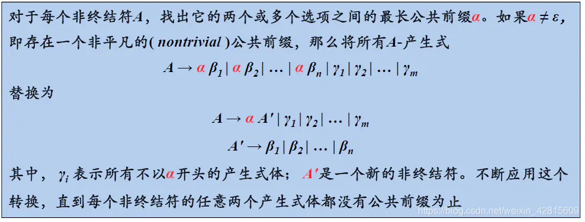

自顶向下分析 `CFG` 树，如果相同产生式左部对应的产生式右部相同公共前缀，那么在语法分析的时候，就不知道该选择那个产生式了。

```
S -> aAc | aBd | cC | d
```

对于非终结符 S，它对应的候选式(即产生式)有相同前缀 a, 当我们要替换 S 的时候，就不知道该选择那一个候选式，因此我们要消除这种情况。
有相同前缀的多个产生式除相同前缀剩余部分联合起来变成一个新的产生式组，让它成为一个新的非终结符对应的候选式组。
例如: 上面式子改写为如下

```
S -> aS' | cC | d
S' -> Ac|Bd
```

#### (2). 消除左递归

当我们自顶向下的语法分析时，就需要采用**最左推导**方式。
而这个时候，如果产生式左部和产生式右部首字符一样(即`A→Aα`)，那么推导就可能陷入无限循环。
算法描述如下：

```
A -> Aα1 | Aα2 | ... | Aαn | β1 | β2 | ... | βm
(其中这里数字表示下标，而不是一个终结符, α 和 β都是文法符号串)
(αi != ε, 且 βi 不以A开头)
改造成
A -> β1A' | β2A' | ... | βmA'
A' ->  Aα1A' | Aα2A' | ... | AαnA' |  ε
```

#### (3). first集

定义: 给定一个文法符号串`α`， `α`的**串首终结符集**`first(α)`被定义为可以从`α`推导出的所有串首终结符构成的集合。

算法总结为如下：

```
（1）如果X是终结符，则first(X) = { X } 。
（2）如果X是非终结符，且有产生式形如X → a…，则first( X ) = { a }。
（3） 如果X是非终结符，且有产生式形如X → ABCdEF…（A、B、C均属于非终结符且包含 ε，d为终结符），需要把first( A )、first( B )、first( C )、first( d )加入到 first( X ) 中。
（4）如果X经过一步或多步推导出空字符ε，将ε加入first( X )。
```

#### (4). follow集

定义: 对于任一非终结符`A`，它的**后继符号集**就是由文法`G`推导出来的所有句型，可以出现在非终结符`A`后边的终结符的集合，记为`FOLLOW(A)`。

```
（1）将$加入到FOLLOW(X)中，其中S是开始符号，而$是输出右端的结束标记。

（2）如果存在一个产生式S->αXβ，那么将集合first(β)中除ε外的所有元素加入到FOLLOW(X)当中。

（3）如果存在一个产生式 S->αX , 或者S->αXβ且first(β)中包含ε , 那么将集合FOLLOW(S)中的所有元素加入到集合FOLLOW(X)中。
```

#### (5). select集

这个是LL(1)的求解目标，通过select集就是建立起来预测分析表，进而给递归向下程序提供基础。

```
A→aβ : a 是终结符，β 是文法符号串，那么这个产生式的可选集SELECT(A→aβ) 就是这个终结符，即{a}。
A→ε : 空产生式对应的可选集SELECT(A→ε) 就是A的后继符号集，即 FOLLOW(A)。
A→Bβ : B 是非终结符，β 是文法符号串，那么这个产生式的可选集SELECT(A→Bβ) 就是文法符号串Bβ的串首终结符集，即first(Bβ)。
注意，如果first(Bβ)包含空串ε，即文法符号串Bβ能推导出空串ε，那么还要将A的后继符号集添加到产生式对应的可选集中。
```

#### (6). 测试用例

测试1

* 原始产生式 <br />
  E->E+T | T <br />
  T->T*F | F <br />
  F->(E) | d <br />
* 提取公因子消除左递归后的产生式 
  E->TE' <br />
  E'->+TE'| ε <br />
  T->FT' <br />
  T'->*FT'| ε <br />
  F->(E) | d <br />
* first集
  first(E)=first(T)=first(F)={(,d} <br />
  first(E')={+,ε} <br />
  first(T')={*,ε} <br />
* FOLLOW集
  FOLLOW(E)=FOLLOW(E')={)} <br />
  FOLLOW(T)=FOLLOW(T')={+,)} <br />
  FOLLOW(F)={*,+,)} <br />

测试2

* 原始产生式
  E -> E+T | E-T | T <br />
  T -> T*F | T/F | F <br />
  F -> (E) | D <br />
  D -> x | y | z <br />
* 提取公因子消除左递归后的产生式
  E -> TE' <br />
  E' -> +T | -T <br />
  E'' -> E' E'' | ε <br />
  T -> FT'' <br />
  T' -> *F | /F <br />
  T'' -> T' T'' | ε <br />
  F -> (E) | D <br />
  D -> x | y | z <br />
* first集
  first(E)=first(T)=first(F)={(,x,y,z} <br />
  first(E')={+,-} <br />
  first(E'')={+,-,ε} <br />
  first(T')={*,/} <br />
  first(T'')={*,/,ε} <br /> 
  first(D)={x,y,z} <br />
* FOLLOW集
  FOLLOW(E)=FOLLOW(E'')={)} <br />
  FOLLOW(T)=FOLLOW(E')=first(T'')={+,-,)} <br />
  FOLLOW(F)=first(D)=first(T')={*,/,+,-,))} <br />

### 2. LR(1)分析法

LR分析法都属于自下向上分析，分析框架是移入-归约分析。分析器创建一个分析栈，从左到右扫描词法分析器中的tokens并将其存放在栈中，且判断是否有**可识别句柄**，若有就将其移出并称为抽象语法树的一个节点。
主要步骤如下：

```
* 从左到右扫描输入符号串，语法分析器将零个或多个输入符号移入到栈的顶端，直到它可以对栈顶的一个文法符号串 `β` 进行归约为止。
* 然后将这个文法符号串 `β` 成某个产生式的左部。
* 语法分析器不断地重复这个循环，直到它检测到一个语法错误，或者栈中包含了开始符号且输入缓冲区为空(当进入这样的格局时，语法分析器停止运行，
并宣称成功完成了语法分析)为止。
```

所以分析过程有以下动作:

```
移入：将输入符号移到栈的顶端。
归约：将栈顶句柄的符号串进行归约，将归约后产生式左部非终结符替换这个符号串。
接收：宣布语法分析过程成功完成；
报错：发现一个语法错误，并调用错误恢复子例程。
```

LR分析器的结构称为有限自动机(Definite Auto Machine)，自动机的每一个状态称为项目集闭包，LR的预测分析表就是根据有限自动机创建出来的。

* LR分析法特点：
  比LL(1)分析法对语法的限制要少得多，适用范围广，适用于大多数上下文无关文法描述的语言。分析速度快，能准确定位错误。
* LR分析法缺点：手工构造分析程序工作量相当大。
* LR分析器的组成：
  总控程序：执行分析表所规定的动作，对进行操作。所有的LR分析器相同。
  符号栈：存放分析过程中移进或归约的符号。
  状态栈：状态栈存放的是状态(标记号)，记录分析过程中从开始的某一归约阶段的整个分析历史或预测扫描了能遇到的分析符号
  预测分析表：LR分析器的核心。其功能指示分析器是移进还是规约，根据不同的文法类要采用不同的构造方法。
  下面先介绍一下LR(0)分析存在的问题，这个问题让我们的解释器不得不选择更强大的LR(1)分析。

#### (1). LR分析法的问题

在所有步骤当中，最重要的一步是**归约动作**，LR(0)分析法的问题也来源于此。

```
例如：
expression -> factor | factor + factor | factor - factor
factor -> power | power * power | power / power
```

观察这个例子会发现，当分析栈中存在factor或者power项时无法判断是执行**移入动作**还是**归约动作**。因为这时factor后跟着+或-号需要移入，
同时也可以归约，这就是移入归约冲突。这时就需要检查语法，同时修改语法。

#### (2). LR(0)分析法的问题

从下图可以看出：

对于I2，由E–>T · 可以知道，无论下一个字符输入什么，我们都要采取归约动作。但是，由T–>T · *F得知，当下个字符是 * 的时候，我们需要采用移进操作。 这里就产生了移进/归约操作。因为当下一个字符是 * 的时候，自动机不知道是用归约，还是移进，就产生了冲突。类似的情况I9也是一样。


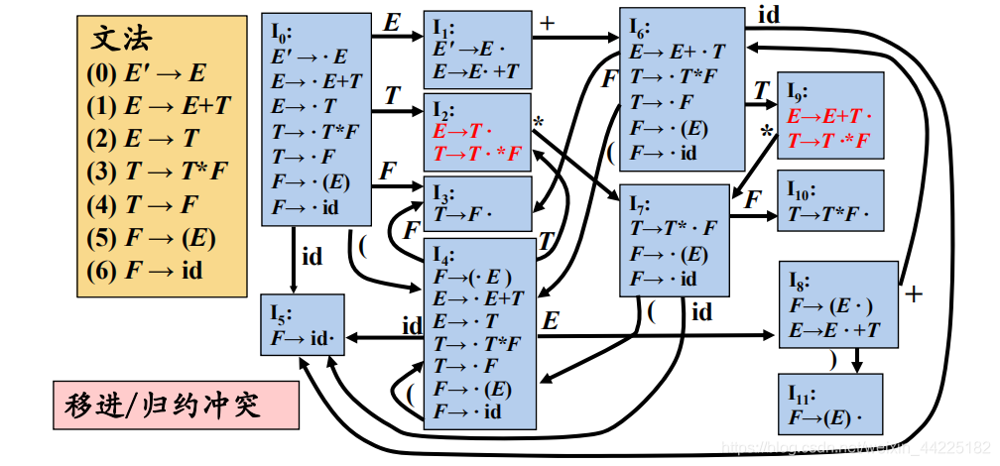

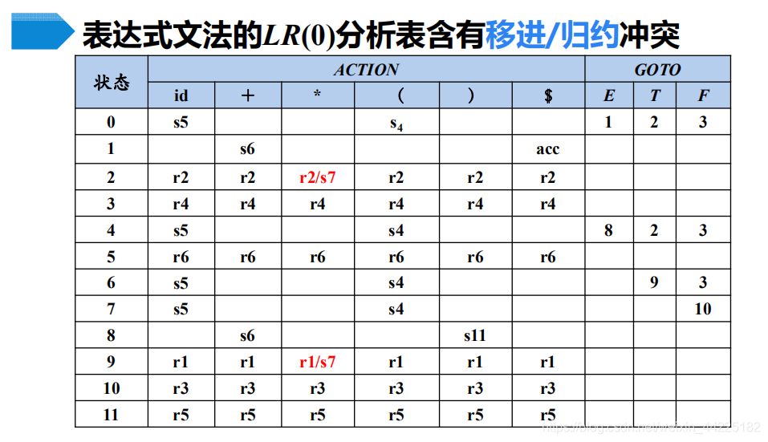

#### (3). LR(1)分析法

要解决移入-归约冲突和归约-归约冲突，最主要的是进行归约的时候，必须是确定的某个终结符才进行归约，那么我们就在项目上再加一个终结符字段，
这样只有当这个项目遇到这个终结符才能进行归约。

##### (a). LR(1)项目集

将一般形式为[A→α·β, a]的项称为LR(1) 项，其中A→αβ 是一个产生式，a 是一个终结符(结束符号$视为一个特殊的终结符)，它表示在当前状态下，
A后面必须紧跟的终结符，称为该项的展望符(lookahead)：

* LR(1) 中的1指的是项的第二个分量向后看的个数。
* 在形如[A→α·β, a]且β ≠ ε的项中，展望符a没有任何作用。
* 但是**一个形如[A→α·, a]的项在只有在下一个输入符号等于a时才可以按照A→α进行归约**。
  每个项目集是有限自动机的一个状态。

##### (b). LR(1)项目集闭包

为构造有效的LR(1)项目集闭包我们需要两个函数closure和go。
closure(I)构造方式如下:

```
(1) I的任何项目都属于closure(I)；
(2) 若项目[A->a.Bβ, a]属于closure(I)，B->γ是一个产生式，则对于first(βa)中的每个终结符b，加入closure(I)中；
(3) 不断重复(2)直到不再扩大。
```

GO(I,X)构造方式如下：
I表示当前状态，X表示下一个状态

```
GO(I,X)=closure(J)
J的闭包要遍历I中每个形如[A->a.Xβ,a]的项目，将[A->aX.β,a]的项目加入J。
```

最后求解项目集闭包，过程如下：

```
(1) 初始化开始符号的项目集闭包；
(2) 遍历开始的项目集闭包的每一个产生式是否满足GO(I,X)不为空且未在下一个项目集当中；
(3) 不断重复(2)直到项目集闭包不再增加。
```

##### LR(1)预测分析表

最后就可以根据创建好的有限确定自动机构造(dfa)预测分析表，算法如下：

```
对于当前状态i来说，
(1) 如果产生式满足[A->a.aβ,b]且GOTO(i,a)是下一个状态j，那么执行移入动作，记为ACTION[i,a]=sj；
(2) 如果产生式满足[A->a.Bβ,b]且GOTO(i,B)是下一个状态j，那么转移到下一个状态，记为GOTO[i,B]=j；
(3) 如果产生式满足[A->a.,a]且A不是开始字符，那么执行归约动作，记为ACTION[i,a]=rj；
(4) 如果产生式满足[S'->S.,#]，其中S'是增广开始字符，那么完成分析工作，记为ACTION[i,#]=acc；
(5) 除此以外的情况都是error。
```

### 3.LR(1)分析法测试用例
#### (1).本解释器文法
##### (a). first集
first(assignment_expression) = {id} <br />
first(selection_statement) = {if} <br />
first(statement) = {if, id} <br />
first(S) = {if, id, $} <br />
first(samplings) = {vonmises, uniform, discrete, gauss} <br />
first(primary_expression) = {string, vonmises, uniform, discrete, gauss, (, number, id, False, True} <br />
first(comp_op) = {<, <=, ==, !=, >, >=} <br />
first(unary_op) = {ceil, arcsin, abs, neg, arctan, pos, floor, sin, tan, arccos, 
                  trunc, cos, log, round} <br />
first(secondary_operator) = {//, %, *, /} <br />
first(primary_operator) = {-, +} <br />
first(power_expression) = {string, pos, floor, id, (, arccos, **, round, vonmises, uniform, discrete, gauss,
                          abs, False, cos, log, tan, ceil, arcsin, neg, arctan, number, sin, trunc, True} <br />
first(term_expression) = {string, pos, floor, id, /, //, (, arccos, **, round, vonmises, uniform, discrete, gauss
                          , abs, %, False, cos, log, tan, ceil, arcsin, neg, arctan, number, sin, trunc, True, *} <br /> 
first(expression) = {string, pos, floor, id, /, //, (, -, arccos, **, round, vonmises, uniform, discrete, gauss,
                    abs, %, False, cos, log, tan, +, ceil, arcsin, neg, arctan, number, sin, trunc, True, *} <br />
first(comparison) = {string, pos, floor, id, /, //, (, -, arccos, **, round, vonmises, uniform, discrete, gauss, 
                    abs, <, <=, %, ==, False, cos, >, log, >=, tan, +, ceil, arcsin, neg, arctan, number, sin, 
                    trunc, !=, True, *}  <br />
first(not_expression) = {string, pos, floor, id, /, //, (, -, arccos, **, round, vonmises, uniform, discrete, gauss, 
                        abs, <, not, <=, %, ==, False, cos, >, log, >=, tan, +, ceil, arcsin, neg, arctan, number, 
                        sin, trunc, !=, True, *} <br />
first(and_expression) = {string, pos, floor, id, /, //, (, -, arccos, **, round, vonmises, uniform, discrete, gauss, 
                        abs, <, not, <=, %, True, ==, False, cos, >, log, >=, tan, +, ceil, arcsin, neg, arctan, number,
                        sin, trunc, !=, and, *} <br />
first(or_expression) = {string, or, pos, floor, id, /, //, (, -, arccos, **, round, vonmises, uniform, discrete, gauss, 
                      abs, <, not, <=, %, True, ==, False, cos, >, log, >=, tan, +, ceil, arcsin, neg, arctan, number, 
                      sin, trunc, !=, and, *} <br />
first(assignment_operator) = {%=, +=, /=, -=, //=, *=, =} <br />
first(set_op) = {-, |, &, ×} <br />
first(atom): {False, string, True, number} <br />
first(atom_list) = {, , $} <br />
first(elements) = {[} <br />
first(primary_set) = {set, (, id} <br />
first(set_expression) = {|, set, (, -, ×, id, &} <br />
first(assignment_set) = {id} <br />
first(dist) = {vonmises, uniform, discrete, gauss} <br />
first(samplings): {vonmises, uniform, discrete, gauss} <br />
first(elif_statement) = {elif, $} <br />
first(else_statement) = {else, $} <br />
##### (b).确定状态自动机
LR(1)状态过多，只列举部分结果，请移步同文件夹下dfa.drawio文件
##### (c).预测分析表
请移步同文件夹predict.csv文件
##### (d).表达式测试
###### 用例1
表达式：a1 = ((534-23)//2.1+423)*23.1+1.1 
结果：9749.300000000001
ast:
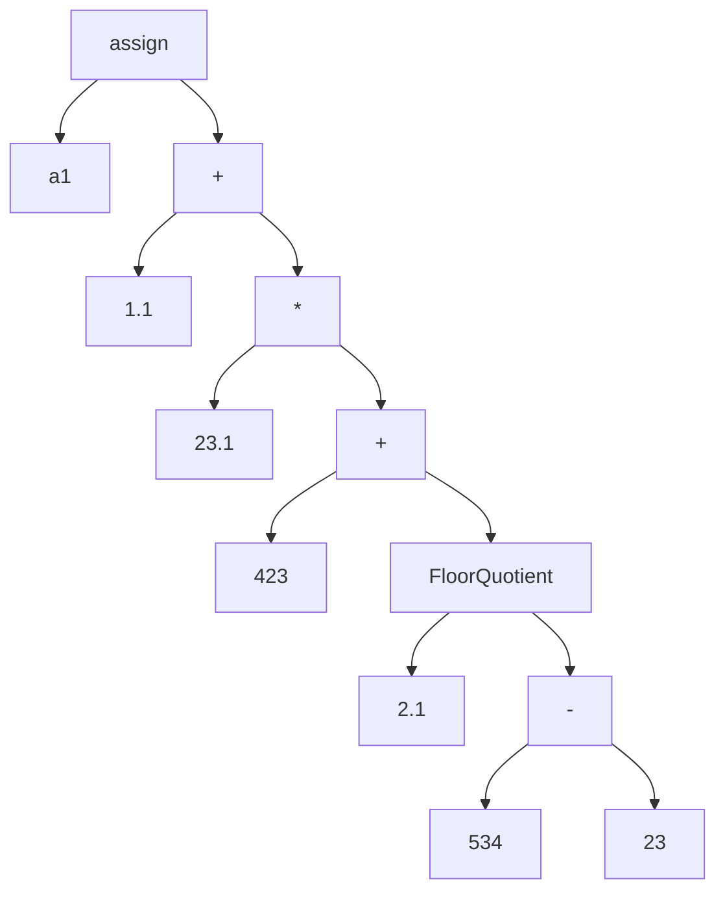
###### 用例2
表达式：a = 2^sin(2)
结果：1.8781306511987292
ast:
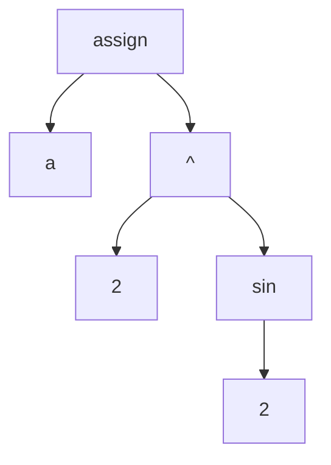
###### 用例3
表达式：a = a = 2^sin(2+1)
结果：1.1027608904867825
ast:
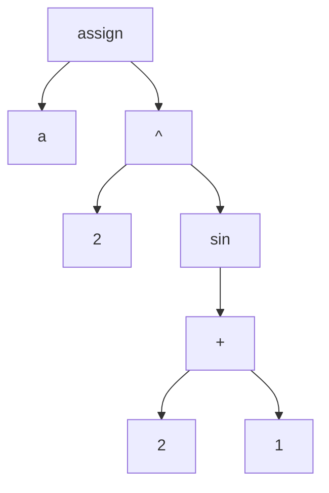
###### 用例4
表达式：a = 2^sin((2+1)*2)
结果：1.1027608904867825
ast:
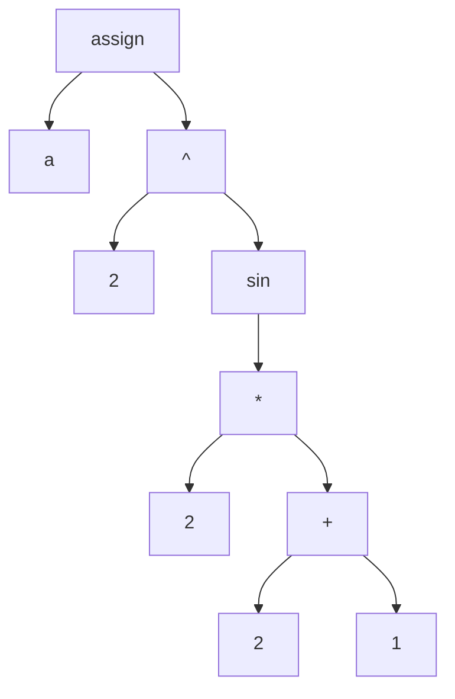
###### 用例5
表达式：a = 2^sin((2+1)*2)
结果：1.1027608904867825
ast:

###### 用例6
表达式：a = 2^sin(sin(sin(2)))
结果：1.635464042186862
ast:

###### 用例7
表达式：a = abs(sin(cos(tan(floor(ceil(2))))))
结果：0.5449592372801408
ast:
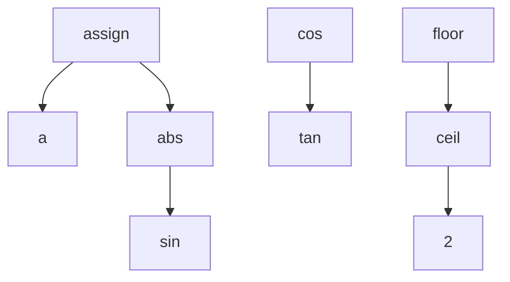
###### 用例8
表达式：a = True and False
结果：False
ast:
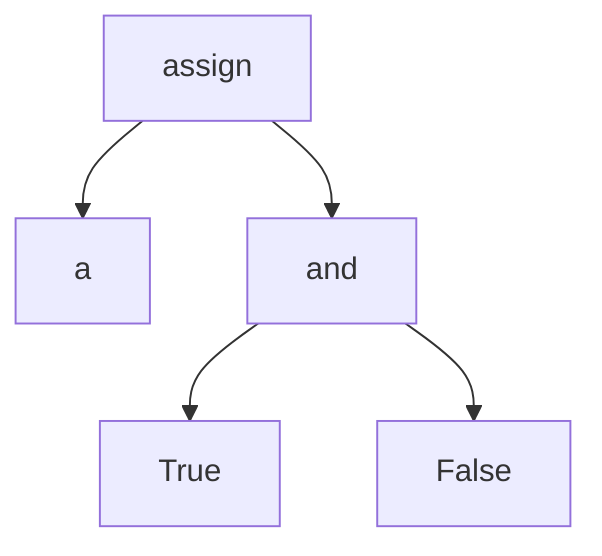
###### 用例8
表达式：a = False or True
结果：False 结果错误 
ast:
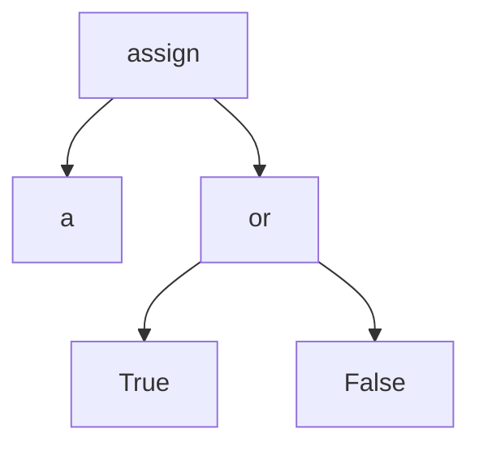
树的结果没有错误
###### 用例9
表达式：a = True and (False or True)
结果：False 结果错误 
ast:
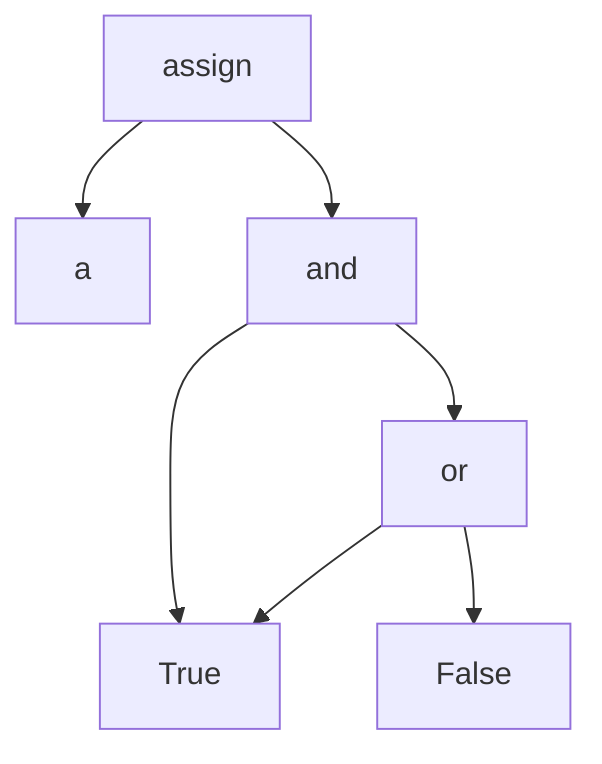
树的结果没有错误

###### 用例10
表达式：a = not True
结果：False
ast:
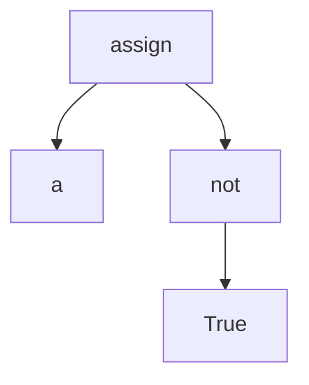

###### 用例11
表达式：a = 1 == 1 == 1 
结果：True
ast:
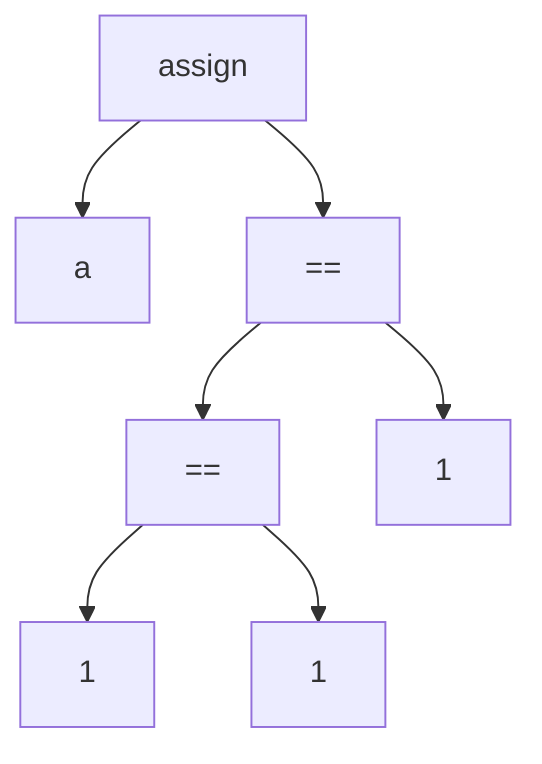
###### 用例12
表达式：a = 1 ≥ 1 == 1
结果：True
ast:
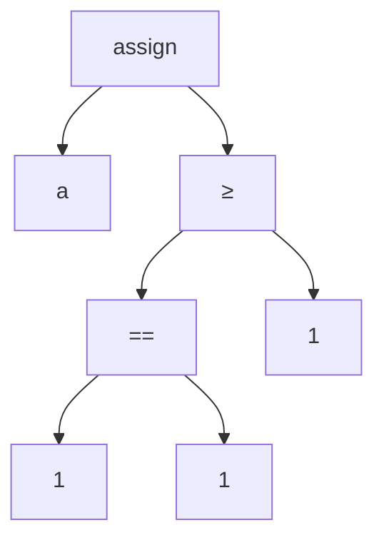
###### 用例13
表达式：a = 1.1 ≥ 1 == 1
结果：True
ast:
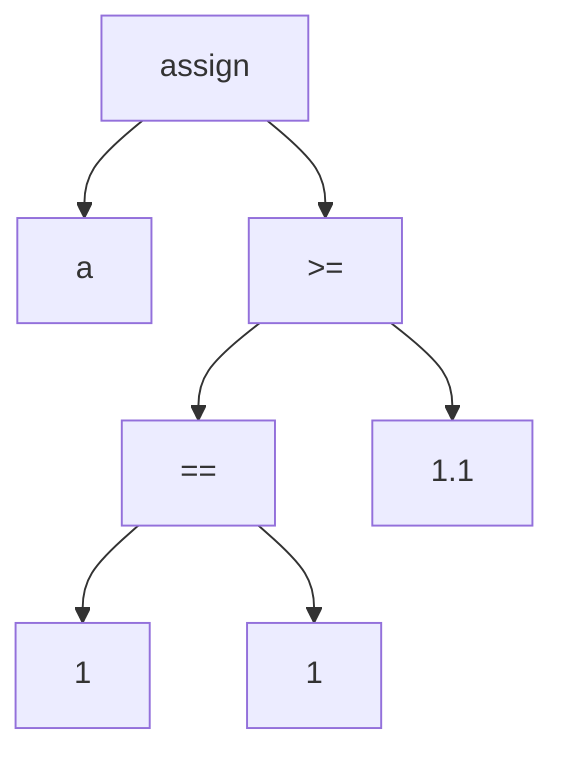


## 四.语义分析

需要在变量系统内实现

## 五.范式描述

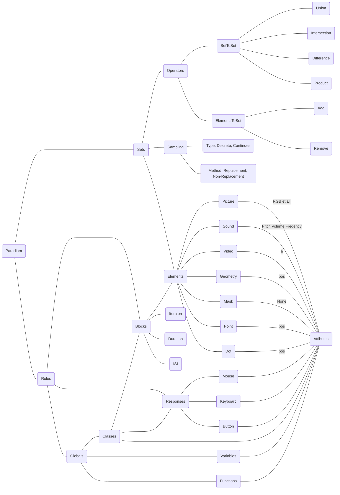

### 测试用例

#### 威斯康辛卡片

```json
{
  "set": {
    "numbers": {
      "sampling": {
        "distribution": "uniform",
        "method": "Non-replacement"
      },
      "elements": [
        1,
        2,
        3,
        4
      ]
    },
    "Colors": {
      "sampling": {
        "distribution": "uniform",
        "method": "Non-replacement"
      },
      "elements": [
        "red",
        "yellow",
        "blue",
        "green"
      ]
    },
    "Shapes": {
      "sampling": {
        "distribution": "uniform",
        "method": "Non-replacement"
      },
      "elements": [
        "star",
        "triangle",
        "square",
        "diamond"
      ]
    }
  },
  "rules": {
    "1": {"globals": "object <- numbers \\product Colors \\product Shapes"},
    "2": {"globals": "card <- Sampling(object)"},
    "3": {"globals": "samplings <- Uniform{Set(numbers),Set(Shapes),Set(Colors)}"},
    "4": {"blocks": {
          "name": "blocks_1",
          "attributes":{
            "1": "select <- \\begin{cases} Set(numbers)& Set(numbers)=samplings | Set(Shapes)& Set(Shapes)\\in samplings | Set(Colors)& Set(Colors)\\in samplings\\end{cases}"
          },
          "iteration": "counter=10",
          "duration": "infinite",
          "isi": "infinite",
          "condition": "samplings& counter=10"
         }},
    "5": {"responses":[
          "r <- \\begin{cases} 0& blocks_1.select \\in sampling | 1& blocks_1.select \\in (Set(Colors, Shapes, numbers) \\Difference sampling) \\end{cases}"
        ]},
    "7": {"globals": "counter <- 0"}, 
    "8": {"globals": "counter <- \\begin{cases} +1& r=0 | 0& r=1 \\end{cases}"}
  }
}
```

#### N270

```json
{
  "set": {
    "Colors": {
      "sampling": {
        "distribution": "uniform",
        "method": "Non-replacement"
      },
      "elements": ["red","yellow","green","white"]
    },
    "Shapes": {
      "sampling": {
        "distribution": "uniform",
        "method": "Non-replacement"
      },
      "elements": ["triangle","square","pentagon","hexagon","diamond","spindle","star","circle","oval","pentagram","cross"]
    }
  },
  "rules": {
    "1": {"globals": "object <- Colors \\product Shapes"},
    "2": {"globals": "rate <- C-S-：1|C-S-：1|C-S-：1|C-S-：1"},
    "3": {"globals": "condition <- {C-,C+} \\ product {S-,S+}"},
    "4": {"globals": "C1,S1 <- Sampling(rate, condition)"},
    "5": {"globals": "C2 <- C1& C1 \\in C+ |Sampling(object \\difference {S1}, rate) & C1 \\in C-"},
    "6": {"globals": "S2 <- S1& S1 \\in S+ |Sampling(object \\difference {S1}, rate) & S1 \\in S-"},
    "7": {"globals": "sample_1,sample_2 <- Sampling(object, [(C1,S1),(C2,S2)])"},
    "8": {"block": {
      "name": "blocks_1",
      "attributes": {
        "1": "run(C1,S1)",
        "2": "run(C2)",
        "3": "run(S2)",
        "4": "run(sample_1,sample_2)"
      },
      "iteration":  "任意",
      "duration": "500",
      "isi": "200"
    }, 
    "3": {
      "responses": [
        "r <- 1& left|0& right"
      ]
    },
    "4": {"globals": "counter <- 0"},
    "5": {"globals": "counter <- counter + r"}, 
    "6": {"globals": "timer <- 0"},
    "7": {"globals": "timer <- timer + 1"},
    "8": {"globals": "acc <- counter / timer"}
    }
  }
}
```
